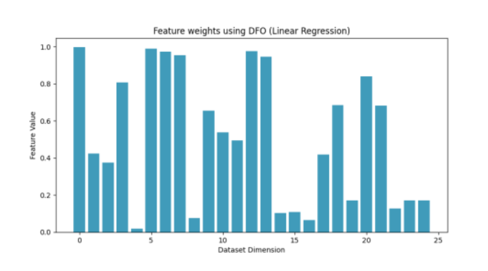

# Feature selection using swarm intelligence

> Welcome to the implmentation of Feature Selection using Swarm Intelligence - Dispersive Flies Optimisation

<h3>Disclaimer</h3>
This project is a <i>novel</i> approach in the respective field with multiple authors having proposed thier own solutions.
It has been designed and developed through detailed and exhaustive research in the field of swarm intelligence and feature selection.
This piece of work remains as a submitted group-coursework designed by the author and hence should not be copied as an original work for other fields, including but not limited to the academics.
Please feel free to contact the author should you have any queries about the accuracy or any other details.

<h3>Abstract</h3>
The sudden rise in cases due to the outburst was an indication of a possibility of an emergence of a new virus. Although the specific location of the virus’ origination could be difficult to locate, regions with the most encouraging factors observed a significant outburst in cases. These factors called for an immediate cessation of the exponential growth of the virus which could be possible only by identification of the factors influencing the outburst. This paper explores the possibility of implementing Machine Learning Algorithms to highlight the most significant factors which influence the outburst with the help of a
swarm-based intelligence technique. The iterative and stochastic nature of the swarm method helped in identifying the most prominent features. In order to increase the accuracy of the prediction, two fitness functions were implemented and their resulting overlapping (common) features were considered. The resulting predictions were compared with the results obtained from the group members and the most effective algorithm was stated.

<h3>Experimental results</h3>

  
  

<h4>Significant Features reflected using Linear Regression and Random Forest on Dispersive Flies Optimisation</h4>

<h3>Citations</h3>

> Few of the many citations...
1. https://jamanetwork.com/journals/jama/article-abstract/2788485
2. https://www.mdpi.com/2076-3417/8/9/1521
3. https://link.springer.com/chapter/10.1007/978-3-540-73435-2_6
